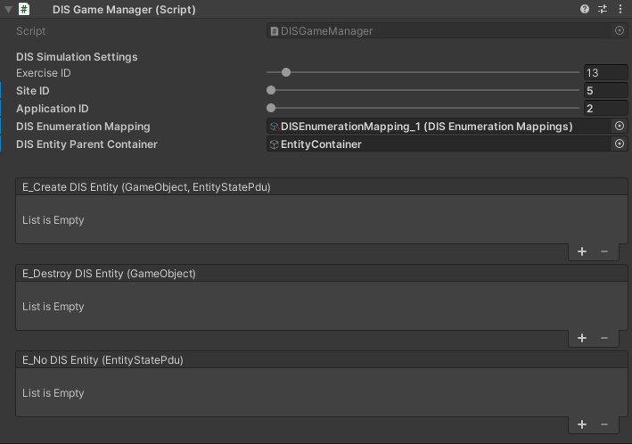
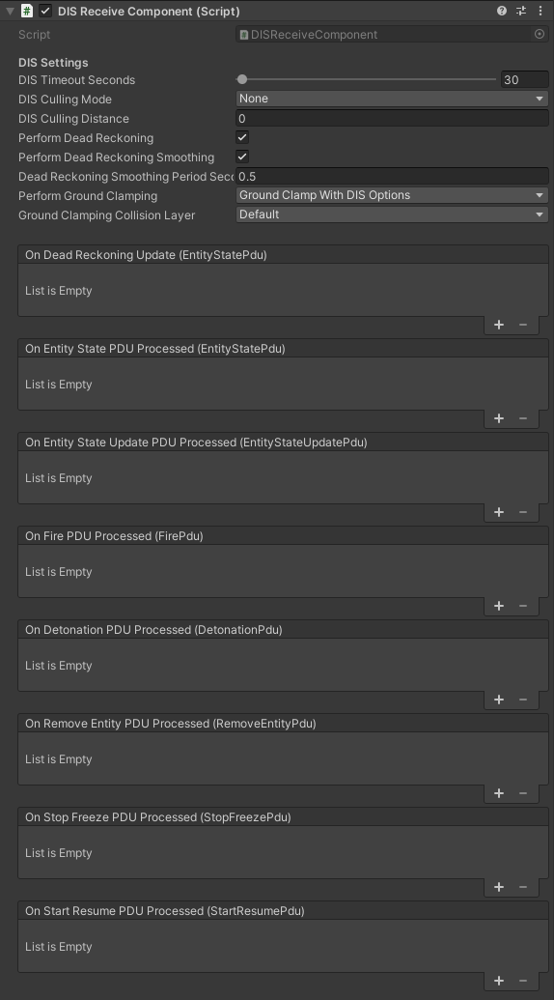

# Getting Started

- This plugin was made for Unity 2020.3.26f1
- Clone this repository
- Put the unpacked plugin folder in the 'Plugins' folder for the desired project.
    - The plugins folder should be located in the root directory of the project. If not, create one.
- Launch the project and allow Unreal to rebuild needed modules.
- The GRILL DIS for Unreal plugin should be enabled upon the project opening.

# Required Game Objects
- Certain game objects are required to be in a given scene in order for the plugin to work as desired. These are listed below:
	- _**NOTE:**_ Only one of each unique game object type listed below should be in a single level.

- The DIS Manager game object is required in the level and is built into the GRILL DIS for Unity plugin.
	- This game object stores the DIS Enumeration to class mappings and other various DIS information.
	- More information on the script itself can be found in the **DIS Game Manager section** below.

# PDU Receiver Script

- The PDU Receiver script is what is used to handle receipt of UDP packets.
- Delegates received PDUs to appropriate DIS entity game object.
- Notable functions:
    - Start UDP Receiver

The PDU Receiver script has the following settings:
- **Auto Connect at Start**
	- Whether or not the UDP socket for receiving DIS packets should be auto connected.
- **Use Multicast**
	- Whether or not this socket will be receiving Multicast connections.
- **Allow Loopback**
	- Whether or not to receive packets that originate from our local IP.
- **IP Address**
	- The IP address to receive DIS packets on. Will only be used if Use Multicast is disabled.
- **Multicast Address**
	- The Multicast address to receive DIS packets on. Will only be used if Use Multicast is enabled.
- **Port**
	- The port to receive DIS packets on.
	
# PDU Sender Script

- The PDU Sender script is what is used to handle sending of UDP packets.
- Delegates received PDUs to appropriate DIS entity game object.
- Notable functions:
    - Init
		- Starts the sender
	- Stop
	- Change Address
		- Safely updates the IP and Port of the sender
	- Contains send methods for all OpenDIS supported PDU types

The PDU Sender script has the following settings:
- **Connection Type**
	- The type of connection to open for sending.
	- Options are:
		- Unicast
		- Broadcast
		- Multicast
- **Auto-Connect**
	- Whether or not the UDP socket for sending DIS packets should be auto connected.
- **IP Address**
	- The IP address to receive DIS packets on. Will be disabled if Connection Type is set to Broadcast. Should be a Multicast address if the socket connection type is set to Multicast.
	- _**NOTE:**_ If Connection Type is set to Broadcast, outgoing DIS packets will be broadcasted on 255.255.255.255.
- **Port**
	- The port to send DIS packets on.
- **Max Queue Size**
	- The maximum number of queued outgoing PDUs before the most recent ones get removed.

# DIS Game Manager

- The DIS Game Manager is responsible for creating/removing DIS entities as packets are processed by the PDU Receiver script. It also informs the appropriate DIS Entities when DIS packets are received that impact them. This is done through notifying their associated DIS Component script.
- The DIS Game Manager has the following settings:
    - **Exercise ID**: The exercise ID of the DIS sim this project will be associated with.
    - **Site ID**: The site ID of this DIS sim.
    - **Application ID**: The application ID of this DIS sim.
	- **Entity Types**: Contains desired game object to DIS Enumeration mappings.
        - _**NOTE:**_ Although not required, for proper DIS delegation each game object in the Entity Types mapping should have a DIS Component script attached to it.
	- **DIS Entity Parent Container**: The parent that all of the DIS Entities spawned by the plugin should be placed under.

- The DIS Game Manager contains:
    - Listing of DIS Entities and their associated enumeration. This is loaded from the Entity Types variable.
    - Listing of Entity IDs and their active DIS Entities in the world. This is a living list that is added to/removed from as new packets are received.
    - The DIS exercise, site, and application IDs.
- Notable functions:
	- Spawn or Get Game Object from Entity State PDU
    - Add DIS Entity to Map
    - Remove DIS Entity from Map

# DIS Receive Component Script

- The DIS Receive Component script is responsible for handling all receive DIS functionality and DIS PDU updates for its associated DIS Entity.
- Handles dead reckoning and ground clamping updates.
- Contains various DIS related variables.
- Notable functions:
    - Ground Clamping
		- Default implemented behavior line traces toward the earth using NED vectors. Places the entity on the hit location on the ground.
        - Can be overriden for a custom implementation.
- Contains event bindings for:
    - Receiving each type of DIS Entity PDU currently implemented.
    - Dead reckoning update

	
- Has variables for:
    - Most Recent Entity State PDU
    - Dead Reckoning Entity State PDU
        - This is an Entity State PDU whose information has been updated with the most recent Dead Reckoning information.
    - Latest Entity State PDU Timestamp
    - Spawned From Network
        - Whether or not this entity was spawned from the network.
    - Entity Type
		- This record specifies the kind of entity, the country of design, the domain, the specific identification of the entity, and any extra information necessary for describing the entity.
        - This value gets set when an Entity State PDU or Entity State Update PDU is received for the associated entity.
    - Entity ID
		- This record specifies the site ID, application ID, and entity ID fields. They combine to form a unique identifier of the entity in the exercise.
        - This value gets set when an Entity State PDU or Entity State Update PDU is received for the associated entity.
    - Entity Force ID
		- This field distinguishes the different teams or sides in a DIS exercise.
        - This value gets set when an Entity State PDU or Entity State Update PDU is received for the associated entity.
    - Entity Marking
		- This record is used to specify the friendly name of the entity to be interpreted for display.
        - This value gets set when an Entity State PDU or Entity State Update PDU is received for the associated entity.
    - DIS Timeout
		- How long to wait in seconds after an Entity State PDU is received before deleting. Gets refreshed after an Entity State PDU is received.
	- DIS Culling Mode
		- Culls DIS packets based on settings
			- Options:
				- None
				- Cull Dead Reckoning
					- Cull Dead Reckoning updates. Distance updates get culled at is dictated by the 'DIS Culling Distance' variable.
				- Cull All
                    - Currently only culls Dead Reckoning updates.
	- DIS Culling Distance
		- The distance away from the camera that entities will start to have DIS packets culled.
    - Perform Dead Reckoning
        - Whether or not dead reckoning should be performed.
	- Perform Dead Reckoning Smoothing
		- Whether or not to smooth location/rotation changes after receiving a new Entity State update. Prevents entity teleporting.
	- Dead Reckoning Smoothing Period Seconds
		- Time in seconds that smoothing should take place.
    - Perform Ground Clamping
        - Performs ground clamping based on settings
			- Options:
				- None
				- Ground Clamp with DIS Options
					- Perform ground clamping. Ignore ground clamping for munitions and non-ground entity types.
				- Always Ground Clamp
					- Always perform ground clamping regardless of entity type.
    - Ground Clamping Collision Channel
        - The collision channel that should be used for ground clamping.

# DIS Send Component Script

- The DIS Send Component handles basic sending DIS functionality its associated DIS Entity.
- Contains various DIS related variables.
- Notable functions:
	- Form Entity State PDU
		- Uses all known information to form an ESPDU for the associated DIS Entity.
    - Send Entity State PDU
		- Default implemented behavior tries to send out an Entity State or Entity State Update PDU based on Entity State PDU Sending Mode variable.
		- Called on update as thresholds need consistently checked.
        - Can be overriden for a custom implementation.
    - Set Entity Appearance
		- Used to update the entity appearance during runtime.
    - Set Entity Capabilities
		- Used to update the entity capabilities during runtime.
	- Set Dead Reckoning Algorithm
		- Used to update the dead reckoning algorithm during runtime.
	

- Has variables for:
    - Most Recent Entity State PDU
    - Dead Reckoning Entity State PDU
        - This is an Entity State PDU whose information has been updated with the most recent Dead Reckoning information.
    - Entity Type
		- This record specifies the kind of entity, the country of design, the domain, the specific identification of the entity, and any extra information necessary for describing the entity.
        - This value should be set on the component and will be used when sending automatic PDU updates.
    - Entity ID
		- This record specifies the site ID, application ID, and entity ID fields. They combine to form a unique identifier of the entity in the exercise.
        - This value should be set on the component and will be used when sending automatic PDU updates.
    - Entity Force ID
		- This field distinguishes the different teams or sides in a DIS exercise.
        - This value should be set on the component and will be used when sending automatic PDU updates.
    - Entity Marking
		- This record is used to specify the friendly name of the entity to be interpreted for display.
        - This value should be set on the component and will be used when sending automatic PDU updates.
    - DIS Heartbeat Seconds
		- How often a new PDU update should be sent out.
		- Utilized if Dead Reckoning Thresholds are not clipped.
	- Entity State PDU Sending Mode
		- Mode that the send component should be in.
			- Options:
				- None
					- Don't send any automatic Entity State or Entity State Update PDU updates.
				- Entity State PDU
					- Automatically send out Entity State PDU updates.
					- Will send out a new PDU when a Dead Reckoning Threshold is clipped, the DIS heartbeat expires, when the Dead Reckoning algoritm is changed, when the entity Capabilities are changed, when the entity Appearance is changed, or when the entity expires in the world.
				- Entity State Update PDU
					- Automatically send out Entity State Update PDU updates.
					- Will send out a new PDU when a Dead Reckoning Threshold is clipped, the DIS heartbeat expires, when the entity Appearance is changed, or when the entity expires in the world.
    - Entity Appearance
        - Represented as an int-32 field. Specifies the dynamic changes to the entities appearance attributes.
        - Refer to DIS Standard IEEE 1278.1 document for a breakdown.
    - Entity Capabilities
        - Represented as an int-32 field. A collection of fields which describe the capabilities of the Entity.
        - Refer to DIS Standard IEEE 1278.1 document for a breakdown.
	- Dead Reckoning Algorithm
		- The dead reckoning algorithm to use.
    - Dead Reckoning Position Threshold Meters
        - The position threshold in meters to use for dead reckoning. If the dead reckoning position deviates more than this value away from the actual position in any axis, a new Entity State PDU will be sent.
    - Dead Reckoning Orientation Threshold Degrees
        - The orientation threshold in degrees to use for dead reckoning. If the dead reckoning orientation deviates more than this value away from the actual orientation, a new Entity State PDU will be sent.

# DIS Conversion Library

- Contains static functions for converting between various geospatial coordinates.

# Dead Reckoning Library

- Contains functions for performing Dead Reckoning

